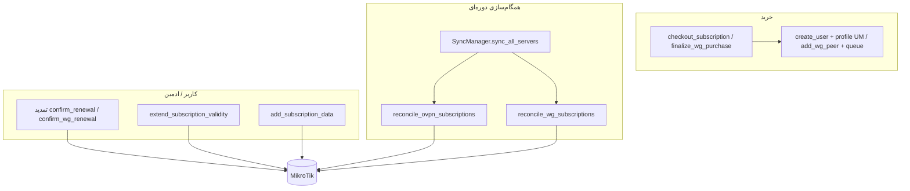

# سیاست ترافیک، انقضا، تمدید و پهنای‌باند

این سند منطق **User Manager (چندپروتکل)** و **WireGuard** را در ربات و ارتباط با MikroTik توضیح می‌دهد.

## نمای کلی



---

## چندپروتکل (OpenVPN / User Manager)

| موضوع | محل در کد | روی روتر | در DB |
|--------|-----------|----------|--------|
| سقف حجم | `Profile.data_limit_gb` → `lim_{name}` با `transfer-limit` | UM محدودیت را اعمال می‌کند | `Subscription.total_limit_bytes`, `used_bytes` |
| مصرف | `SyncManager.reconcile_ovpn` | `download-used` + `upload-used` | `used_bytes` به‌روز می‌شود |
| پر شدن حجم | همان sync (پشتیبان) | `disable_user` | `status = disabled` |
| انقضای زمان | همان sync | `disable_user` | `status = expired` |
| تمدید کاربر | `confirm_renewal` | `enable_user` + `extend_validity` + `add_data_to_user` | `expiry_date` جدید |
| تمدید ادمین | `extend_subscription_validity` | `extend_validity` | `expiry_date += days` |
| افزایش حجم ادمین | `add_subscription_data` | `transfer-limit` روی `lim_{profile}` | `total_limit_bytes +=` |
| پهنای‌باند پلن | `Profile.rate_limit` → `create_profile_with_limits` | `rate-limit-rx/tx` روی limitation | — |

**نکته:** محدودیت اصلی حجم روی روتر از طریق User Manager است؛ sync فقط مصرف را می‌خواند و در صورت عبور از سقف DB، کاربر را غیرفعال می‌کند.

---

## WireGuard

| موضوع | محل در کد | روی روتر | در DB |
|--------|-----------|----------|--------|
| سقف حجم | `WireGuardProfile.volume_gb` | *(قبلاً فقط DB)* — از sync: غیرفعال peer | `bytes_remaining` = سقف خرید |
| مصرف | `reconcile_wg` | `rx` / `tx` peer (تجمعی با delta) | `total_bytes_rx/tx`, `last_router_rx/tx` |
| پر شدن حجم | `reconcile_wg` (جدید) | `set_wg_peer_status(disabled)` | `status = disabled` |
| انقضا | `reconcile_wg` | peer غیرفعال | `status = expired` |
| تمدید | `confirm_wg_renewal` | peer فعال + baseline counters | expiry، صفر RX/TX، `bytes_remaining` ریست |
| پهنای‌باند | `add_wg_queue` در خرید؛ sync صف گم‌شده را می‌سازد | Simple Queue `name = unique_identifier` | `profile.rate_limit` |

**رفع باگ:** نام صف در sync قبلاً `wg_{id}` بود ولی در خرید `unique_identifier` — یکسان شد.

---

## تمدید اشتراک (کاربر + ادمین)

منطق متمرکز در `renewal_policy.py`:

| وضعیت اشتراک | تمدید (اگر در ادمین فعال باشد) |
|--------------|--------------------------------|
| حجم تمام شده | ✅ همیشه |
| زمان تمام شده | ✅ همیشه |
| هر دو | ✅ همیزه |
| هنوز حجم و زمان دارند | فقط داخل **بازه تمدید** (`sales_renew_window_days`) |

**پنل ادمین → فروش → مدیریت تمدید:**

| تنظیم | کلید |
|--------|------|
| تمدید UM / WG | `sales_um_renew_active`, `sales_wg_renew_active` |
| بازه مجاز تمدید زودهنگام | `sales_renew_window_days` |
| محدودیت بازه | `sales_renew_strict_window` (خاموش = تمدید هر زمان) |
| پیام توقف / زودهنگام / اطلاع | `sales_renew_disabled_msg`, `sales_renew_too_early_msg`, `sales_renew_notification_msg` |

پس از تمدید OVPN: `enable_user` + `extend_validity` + **`set_user_data_limit`** (سقف جدید، نه افزایش تجمعی).

## تست‌ها

### Mock (همیشه در CI/لوکال)

```bash
./scripts/run_traffic_policy_tests.sh
```

فایل: `tests/db/test_traffic_policy_comprehensive.py` (T1–T10) + `tests/db/test_expiry_matrix.py` (E1–E8).

### Live (روتر واقعی)

```bash
pytest tests/live/test_live_traffic_policy.py -m live_mt -v
```

نیاز: `.env.test` با `MIKROTIK_TEST_*` و موجودی کیف پول کاربر integration.

---

## شکاف‌های شناخته‌شده / توصیه

1. **تمدید WG:** شمارنده‌های rx/tx روی روتر تجمعی می‌مانند؛ DB صفر می‌شود و `last_router_*` از روتر خوانده می‌شود تا delta اشتباه نباشد.
2. **UM تمدید:** `extend_validity` در v7 با re-assign پروفایل — رفتار دقیق به نسخه RouterOS وابسته است؛ تست live توصیه می‌شود.
3. **فایل OVPN:** تحویل L2TP/SSTP همیشه؛ فایل `.ovpn` فقط با رکورد `OvpnConfig` در ادمین.
